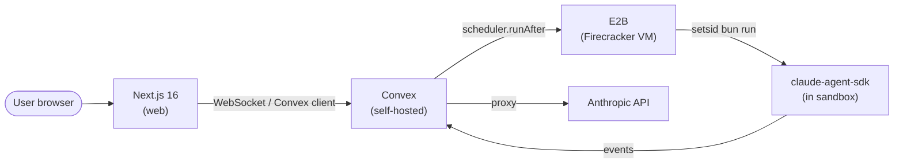
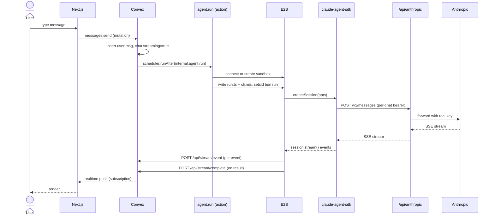
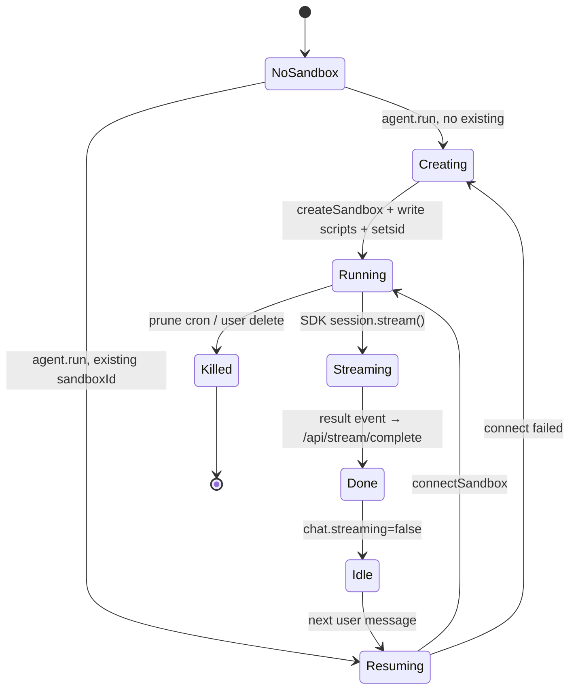
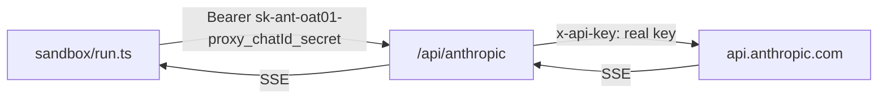
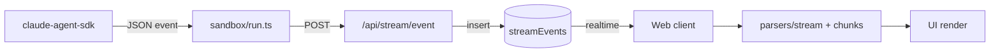
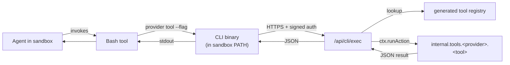
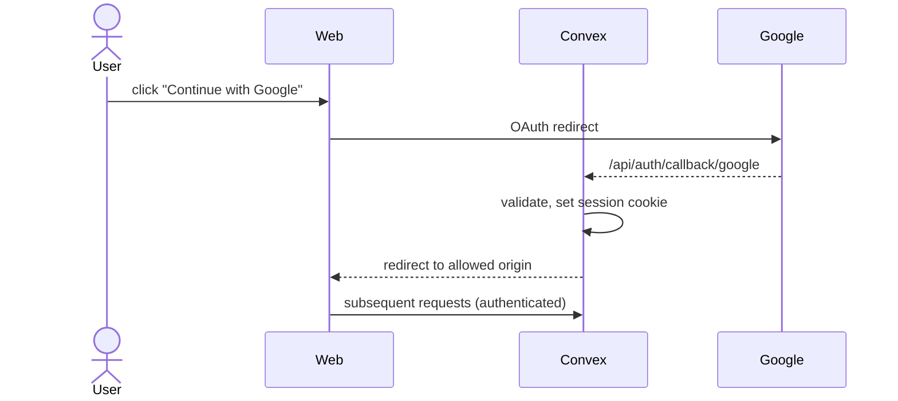
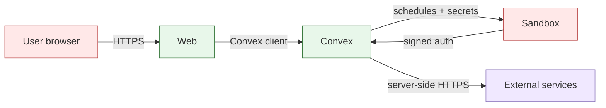

# Architecture

How an agent message flows through the stack: from a user typing in the browser, to Claude in a sandbox, to a streamed response back.

## Why this stack

Each piece earned its place by ruling out alternatives. Brief honest rationale below.

**Convex (self-hosted)** — picked over Supabase / Firebase / Postgres+own backend.

- Reactive subscriptions out of the box: client subscribes to a query, server pushes updates over the same WebSocket — no separate pubsub layer
- Scheduler (`scheduler.runAfter`) is a real durable job runner inside the DB transaction, so “schedule agent run after writing user message” is one atomic operation; no Redis/SQS to coordinate
- httpAction lets us host the Anthropic proxy in the same trust boundary as the DB; per-chat bearer auth + spend caps live next to the data they protect
- Self-hosted = our infra, our SLO; we own the deployment story

**E2B (Firecracker microVMs)** — picked over Docker / Lambda / SSH-to-VM / browser-based runtimes.

- Per-user persistent sandbox with snapshot resume: state across sessions without paying cold-start every turn
- Firecracker isolation is real (kernel-level), not just cgroups
- Resume by sandbox-id; we keep one VM per owner for 14 days, agent reconnects mid-conversation
- Their SDK handles the boring stuff (file upload, exec, stream stdout); we layer setsid + PGID-scoped cleanup on top

**Claude Agent SDK (`unstable_v2_createSession`)** — picked over raw Anthropic API loop.

- Tool loop, retries, session resume, beta header tracking baked in — official Anthropic code, kept in lockstep with API
- Drop-in support for tool definitions, MCP-style providers, system prompts
- We don’t reinvent retry/timeout/abort semantics; SDK already does them

**Next.js 16 + Turbopack + React 19** — picked over Vite / Remix / SvelteKit.

- App Router + server components + streaming SSR + middleware = chat UI patterns work without bolt-ons
- React Server Components let us keep auth/redirect logic on the server, ship less JS
- Same bundle handles auth callback, oauth proxy, static, and dynamic routes
- Mature; Turbopack dev server is fast enough that we don’t notice

**bun workspaces + lintmax** — picked over npm/pnpm/yarn.

- Single `bun install` resolves the whole monorepo; no lockfile churn (no lockfile committed at all — deps pinned to `"latest"`)
- Bun’s test runner is fast enough to run tests on every save without flinching
- lintmax bundles biome+oxlint+eslint+prettier+sort-package-json into one `bun run fix` — no per-package linter config drift

**Multi-app dispatch via `chats.app` discriminator** — picked over per-app backends or per-app schemas.

- One Convex schema serves N apps; each chat row carries the app id; routes by manifest
- Apps share auth, spend caps, sandbox pool, proxy — only their tools/prompt/UI differ
- Adding an app touches one new folder; deleting one is `rm -rf apps/<name>/` plus removing from manifest

**`packages/react/` (extracted UI)** — picked over per-app UI duplication.

- All chat plumbing (hooks, stream parsers, components, registries) lives once
- Apps consume via thin imports + a few config props (prompts, title, registries)
- Bare-bones app = ~12 files; richer apps add their own tool cards / sidebar sections / message-part renderers via registry. Peak shared, peak customizable.

## Stack at a glance

| Layer                | What                                      | Why                                                          |
| -------------------- | ----------------------------------------- | ------------------------------------------------------------ |
| Next.js 16           | Chat UI (Turbopack, React 19, App Router) | Streams messages over Convex’s reactive WebSocket            |
| Convex (self-hosted) | Auth, DB, scheduler, HTTP actions         | Realtime subscriptions out of the box; one place for state   |
| E2B                  | Ephemeral sandbox VM per user             | Firecracker isolation, persistent across turns, low overhead |
| claude-agent-sdk     | Agent loop + tool runtime in sandbox      | Official Anthropic SDK; handles streaming, sessions, tools   |
| Anthropic API        | LLM                                       | Reached via Convex proxy — sandbox never sees the real key   |

## Send → reply, end-to-end

## Sandbox lifecycle

- One user = one persistent sandbox. E2B retention 14 days; pause between messages.
- Per-chat isolation via `CLAUDE_CONFIG_DIR`/`CLAUDE_TMPDIR` namespaced by chat id.
- `setsid` wraps the agent run → kill cleans the whole process group.
- Cross-chat shared memory dir for long-term agent context.

## Anthropic proxy (per-chat bearer)

- Sandbox env strips the real `ANTHROPIC_API_KEY` (`cleanEnv` deletes it before SDK launch).
- Bearer is shaped like an OAuth token but carries `chatId` + per-chat secret.
- Proxy parses, constant-time-compares secret against `chats.secret`, swaps for the real key.
- Limits the blast radius of a compromised sandbox to one chat’s quota.

## Streaming pipeline

- Sandbox posts each SDK event as a sequenced row in `streamEvents`.
- Convex pushes new rows to subscribed clients via WebSocket.
- Client parses chunk-by-chunk; partial deltas (`text_delta`, `thinking_delta`, `input_json_delta`) accumulate until the full block lands.
- One render path unifies completed messages with live stream.

## Tool dispatch

- Tools are Convex actions/queries/mutations registered in a generated registry.
- The agent calls them via a CLI inside the sandbox (`Bash` tool → CLI → HTTPS → Convex).
- CLI auth is a signed token scoped to the chat; not transferable.

## Auth

- Google OAuth via Convex Auth + `@auth/core`.
- `SITE_URL` is a comma-list of allowed redirect origins (multiple environments share one Convex deploy).
- `ALLOWED_EMAILS` env gates who can sign in.
- `auth.getUserIdentity()` available in every Convex function.

## Trust boundaries

- **User + sandbox** → untrusted. The agent runs with `bypassPermissions`; isolation is the VM, not the permission system inside.
- **Convex** → trusted. Holds real API keys, mediates upstream calls, signs tokens.
- **Sandbox → Convex auth** → per-chat rotating UUID secret. Constant-time-compared.

## Why this stack

- **Convex realtime is built-in.** `useQuery` is a reactive WebSocket; no Redis, no SSE plumbing for state.
- **`scheduler.runAfter` lets a mutation kick off a long-running action.** No external orchestrator.
- **`'use node'` actions run full Node.js.** E2B SDK works directly inside Convex.
- **E2B Firecracker** = ~150ms boot, persistent sessions, real Linux. Better fit than serverless containers for an interactive agent.
- **Self-hosted Convex** = own the database, own the auth, no per-row egress fees.
- **claude-agent-sdk** is the canonical agent loop; reusing it means we get session resume, partial streaming, and tool-use semantics for free.
