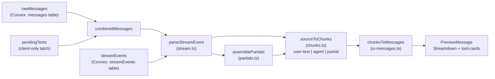
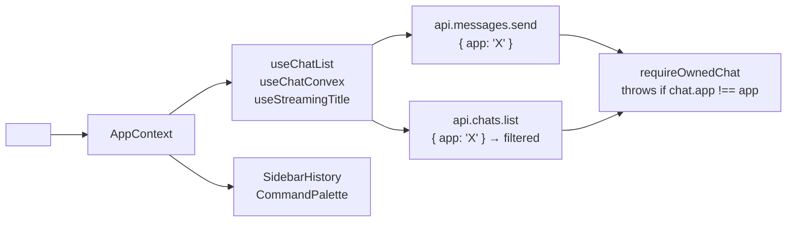

# Lessons Learned

Gotchas and hard-won facts. Merge new lessons into the most relevant section; never append-only.

## Stream rendering

- `sessionMessage` / `anthropicMessage` schemas MUST stay permissive: inner `message` field is `z.record(z.string(), z.unknown()).optional()`; stream-event content arrays are `z.array(z.record(z.string(), z.unknown()))`. Stricter schemas strip block fields (`tool_result.content`, `tool_use_id`) during streaming → blocks render empty until full message lands. Past bug: “tool result only shows after stream ends.”
- `assemblePartials` accumulates only `text_delta`, `thinking_delta`, `input_json_delta`. Skip others.

## Agent / sandbox

- E2B resumed sandboxes skip `bun install` postinstall → claude-code binary loses exec bit. `chmod +x` on resume in `prepareSandboxLayout`.
- `pkill` self-terminates when run from within the same process group. Use `pgrep` + `kill` separately.
- `setsid` wraps the agent launch → per-chat PGID-scoped cleanup. Never omit.
- Concurrent same-file edits across chats are accepted (rare; `HOME` is shared).
- E2B cleanup: `bunx @e2b/cli sandbox kill --all` / `list`.
- **Claude Agent SDK native binary resolution**: bun installs ALL platform `optionalDependencies` regardless of host OS. SDK tries `@anthropic-ai/claude-agent-sdk-linux-${arch}-musl` **before** the glibc variant. On a glibc sandbox, the musl package is still present → SDK picks it → exec fails with ENOENT → “native binary not found” (misleading — binary exists, just wrong libc). Fix is baked into the E2B Dockerfile: `node node_modules/@anthropic-ai/claude-code/install.cjs && rm -rf node_modules/@anthropic-ai/*-musl` after `bun install`. Never reinstall deps inside the running sandbox (the now-removed `rm bun.lock && bun install` in `installAgentDeps` wiped the Dockerfile fix on every fresh launch).

## Framework boundary

- `_api.ts` has 3 `as` casts wiring `internalAction/Query/Mutation` into `ConvexBind`. Convex SDK generics don’t fit widened `BuilderDeps` param types. Cast at that narrow boundary only.
- `arg.number({ integer: true })` is `number` in TS (not branded). Runtime-enforced by `validateArgs`.
- `arg.string({ pattern: '^\\d+$' })` is `string` (not a template literal). Runtime-enforced.

## Typing failure

`ctx.fail` is `(...) => never`, but TS doesn’t narrow at statement level. See RULES “Typing-failure patterns” table for the working/broken patterns.

## Convex quirks

| Quirk                                                                                                                             | Workaround                                                                                                                                                                                                                                                                                                                                            |
| --------------------------------------------------------------------------------------------------------------------------------- | ----------------------------------------------------------------------------------------------------------------------------------------------------------------------------------------------------------------------------------------------------------------------------------------------------------------------------------------------------- |
| Hyphens rejected in module paths                                                                                                  | camelCase filenames; kebab CLI tokens via registry                                                                                                                                                                                                                                                                                                    |
| `.first()` / `.unique()` returns a **thenable**, not a Promise                                                                    | `biome-ignore lint/nursery/noPlaywrightUselessAwait` — do NOT remove the `await`                                                                                                                                                                                                                                                                      |
| `biome useAwait` + tsc `no-redundant-await` conflict on `return await`                                                            | Assign to a const, then return the const                                                                                                                                                                                                                                                                                                              |
| `FilterApi` strips modules exporting intersection-typed `RegisteredAction`                                                        | `as unknown as { argSpecs, meta }` in `tools/generated/registry.ts` — intentional                                                                                                                                                                                                                                                                     |
| Buffer / process typings in `'use node'` actions                                                                                  | Convex `tsconfig.json` needs `"types": ["node"]`                                                                                                                                                                                                                                                                                                      |
| Zod v4 `.optional()` rejects `null`                                                                                               | Use `.nullable().optional()` for SDK data that can be `null`                                                                                                                                                                                                                                                                                          |
| Strict schemas on internal reads drop fields                                                                                      | Permissive schemas (`.optional()`, `z.record(z.string(), z.unknown())`) for all read paths                                                                                                                                                                                                                                                            |
| `CONVEX_SITE_URL` built-in — can’t push via `env set`                                                                             | Leave it out of sync targets; runtime reads built-in, dev .env holds it for x-cli                                                                                                                                                                                                                                                                     |
| `process.env` in V8 runtime is **not enumerable** — `schema.parse(process.env)` sees an empty object and reports ALL keys missing | Read each var by direct property access first: `{ ANTHROPIC_API_KEY: process.env.ANTHROPIC_API_KEY, ... }`, then `schema.parse` on the explicit object. Symptom: SDK retries 10× with `API Error 500` `Uncaught ZodError ... expected nonoptional ... received undefined` for all required envs — looks like Anthropic 500 but is OUR proxy throwing. |

## Anthropic proxy

- **Full passthrough, zero list maintenance.** Block only `authorization` / `host` / `x-api-key` / `content-length` (key swap + length recompute). Forward every other header/beta verbatim. Any header allowlist or beta whitelist will rot the moment the SDK ships a new beta — busywork with zero security gain (spend already capped per-chat + per-owner; Anthropic accepts/rejects betas server-side).
- **“Anthropic 500” is almost always our 500.** The SDK reports upstream errors as `API Error: <status>` text. If you see uniform `500` retries, dump the body — it’s usually our own httpAction throwing (env, schema, codegen drift). Real Anthropic 500s are bursty, not 10/10.
- **Diagnostic flow**: run `bun apps/<app>/scripts/smoke.ts` AND a debug variant that prints `result.result` from the assistant message. The smoke binary reports pass/fail; only the dumped `result` reveals the actual stack trace.

## Multi-app invariants (new baseline 2026-05-06)

The platform serves N apps from one Convex backend. Every cross-app leak vector is closed by design — fail-fast, no fallback, single source of truth for app identity.

- **One source of truth**: `<AppProvider appId='X'>` declared once per app in `app/providers.tsx`. Every hook reads via `useApp()`. Throws if used outside provider.
- **No prop-drilling**: `Chat`, `AppSidebar`, `CommandPalette`, `SidebarHistory` take **no** `app` prop. Hooks pull it from context.
- **Server fail-fast**: `resolveApp(id)` in `apps/manifest.ts` throws on unknown id — there is **no** `DEFAULT_APP_ID` fallback. Every mutation (`send`, `abort`, `remove`, `restore`, `updateTitle`, `testing.send`) takes `app: v.string()` (required).
- **Cross-app rejection**: `requireOwnedChat({ app, chatId, ctx, email })` enforces `chat.app === app`. Direct API calls with mismatched app throw.
- **Filtered queries**: `chats.list({ app })` filters by app; sidebar / command-palette only see their own app’s chats. localStorage cache keyed `chatsList.v1.<app>` to avoid devtools leak.
- **No business strings in shared components**: `multimodal-input` placeholder is a prop. Per-app value passed at `<Chat inputPlaceholder='...' />`. Default = `'Ask anything…'`.

How a new app onboards (full checklist):

1. `apps/<name>/server/index.ts` exports `config: AppConfig`
2. Register in `apps/backend/convex/apps/manifest.ts` `APPS = { ... }`
3. `apps/<name>/src/app/providers.tsx` wraps with `<AppProvider appId='<name>'>`
4. `apps/<name>/src/app/(main)/layout.tsx` renders `<Chat />`, `<AppSidebar />`, etc. — no `app` prop
5. Optional: register `<ToolCardProvider value={ToolCard}>` for app-specific tool UIs

Past bug this prevents: an app’s agent inherited a sibling app’s system prompt because `send` silently fell back to `DEFAULT_APP_ID` when the client didn’t pass `app`. Reproducer: open the app, type “hi” → reasoning leaked the wrong app’s system prompt. Fixed by removing the fallback + threading app through context.

## Chat lifecycle

- **Deleting the active chat** must redirect to `/`. Without that, the URL still points at the dead id, queries return empty, pending/lastError state lingers, UI shows infinite “thinking…”. Implemented via layout `useEffect`: when `activeChatId` set but not in `useChatList()` → `router.replace('/')`. Implemented in `@a/react` so every app inherits.

## Deploy ordering

`bun run deploy` from `apps/backend/`: `build-agent` → `codegen:convex` → `codegen` → `convex dev --once`. CLI bundle (`cliScript.ts`) MUST precede `agentScript` rebuild (agent embeds CLI bundle).

## Cache

Key format: `${tool}:${sha256_12bytes(canonicalize(args))}`. 24 h TTL. `canonicalize` sorts object keys recursively → deterministic hashes. Stores `JSON.stringify(val)`; never feed non-JSON-serializable values. Bump `ToolMeta.version` on breaking schema changes.

## SDK v2 system prompt dead ends

`@anthropic-ai/claude-agent-sdk` (0.2.110 → 0.2.118) has no working programmatic system prompt:

| Channel                                | Why it fails                                                                    |
| -------------------------------------- | ------------------------------------------------------------------------------- |
| `opts.prompt`                          | Silently ignored                                                                |
| `executableArgs`                       | Args for the JS runtime, not the Claude Code CLI                                |
| `pathToClaudeCodeExecutable` wrapper   | Breaks the SDK stdin/stdout JSON streaming protocol                             |
| `.claude/settings.json` `systemPrompt` | Claude Code CLI refuses these as prompt injection (user-editable-file security) |
| `settingSources: ['project']`          | Only controls which settings are loaded; doesn’t bypass the refusal             |

**Working solution**: prepend `<system-instructions>\n${SYSTEM_PROMPT}\n</system-instructions>\n\n${USER_TEXT}` on first turn only (when `RESUME_SESSION_ID === ''`). Resumed sessions inherit. Zero overhead after first turn.

## SDK opt-in-later (deferred with reason)

| API                                        | Added   | Why deferred                                                                                                                                           |
| ------------------------------------------ | ------- | ------------------------------------------------------------------------------------------------------------------------------------------------------ |
| `startup()` / `WarmQuery`                  | 0.2.111 | Returns a `Query`, not `SDKSession`. Our multi-turn loop uses `unstable_v2_createSession`. Reconsider if sub-second first-turn latency becomes a goal. |
| `deleteSession(sessionId)`                 | 0.2.113 | Deletes session files inside the sandbox. Sandbox TTL (1h) evicts stale files anyway. Adopt if agents ever run long-lived on durable infra.            |
| `sessionStore` (alpha)                     | 0.2.113 | Already persist `streamEvents` + `messages` in Convex. Dual-writing = waste; alpha API may break.                                                      |
| `Options.managedSettings`                  | 0.2.118 | Embedder-passed policy-tier settings. Single-tenant app; no fleet policy to enforce.                                                                   |
| Per-tool `permission_policy` on remote MCP | 0.2.111 | Only relevant if we add remote MCP integrations.                                                                                                       |

## Irreducible lint suppressions

All inline with reasons. Never remove without a structural refactor.

| Rule                                      | Reason                                                           |
| ----------------------------------------- | ---------------------------------------------------------------- |
| `complexity/useLiteralKeys`               | tsc `noPropertyAccessFromIndexSignature` vs biome dot preference |
| `performance/noDelete`                    | `delete process.env[KEY]` in test cleanup                        |
| `performance/noAwaitInLoops`              | Sequential Convex DB ops (ordered deletes)                       |
| `style/noProcessEnv`                      | `apps/backend/convex/env.ts` is the single allowed site          |
| `nursery/noPlaywrightUselessAwait`        | Convex `.first()` returns a thenable, not a real Promise         |
| `suspicious/noControlCharactersInRegex`   | Intentional in `sanitizeExternal`                                |
| `suspicious/noBitwiseOperators` (codegen) | `ts.TypeFlags` needs bitwise ops                                 |
| `performance/useTopLevelRegex` (tests)    | Dynamic dispatch regex in test scaffolding                       |

## Single-source-of-truth patterns

When a value or shape appears in 2+ places, extract it. Concrete cases that taught the rule:

**Wire protocol — fixed via `convex/streamProtocol.ts`.** Zod schema for stream events lived in `src/App.tsx` (frontend parse) AND inlined at backend emit site (`JSON.stringify(...)`). Solution: `convex/streamProtocol.ts` exports `streamEvent` (discriminated union for frontend parse), `agentEventEnvelope(subtype, t0, data)` + `errorEventEnvelope(error)` (backend emit), `AgentSubtype` union. Both sides import from same module.

**Constants — `convex/constants.ts`.** `src/App.tsx` had inline `WORKSPACE_ROOT = '/home/user/workspace'`, inline binary-extension list, inline `10 * 1024 * 1024` for MAX_UPLOAD_SIZE — all already in `convex/constants.ts`. Always check there first for magic numbers / paths / enums.

**Prompt-formatting — `_lib/promptBlocks.ts`.** `convex/agentPrompt.ts` had its own inline `Object.values(REGISTRY).filter(...).map(t => \`- ${t.path}...\`)`while the generic`toolListBlock(registry, {tier})` formatter already existed.

**Barrel re-export antipattern — removed.** `src/schemas/stream.ts` was a single-line barrel re-exporting from `convex/stream-protocol`. Extra indirection with zero semantic value. Callers import directly.

### Before writing new code

1. Constant: grep `convex/constants.ts`, `convex/streamProtocol.ts`, `_lib/*.ts`.
2. Zod schema for wire boundary: grep existing Zod in `convex/**` — if cross-boundary, define once.
3. Prompt block formatting: check `_lib/promptBlocks.ts`.
4. Avoid barrel files in app code (project rule). They hide SSoT violations.
