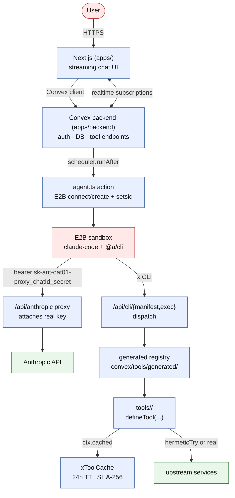
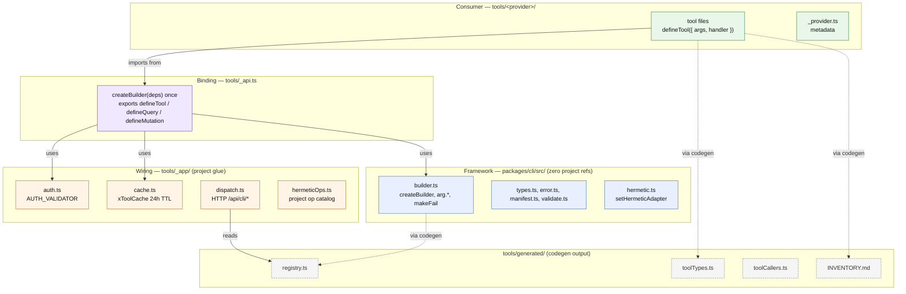
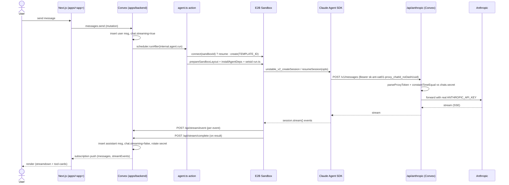

# Architecture

See also: [RULES](RULES.md) · [LEARNING](LEARNING.md) · [SECURITY](SECURITY.md) · [SYNC](SYNC.md).

## System

Trust boundaries: [SECURITY](SECURITY.md#architecture-overview).

## CLI tool system (3 tiers)

Framework is fork-safe (zero project refs). Providers auto-become CLI subcommands (`<provider> <tool>`). `_`-prefixed providers are admin-tier (stripped to `admin` on the CLI). Codegen emits the registry, types, and generated `INVENTORY.md`.

## Agent / sandbox lifecycle

Load-bearing constraints (not derivable from code):

- One user = one persistent E2B sandbox (pause/resume, 14-day retention).
- `setsid` wraps the agent run so PGID-scoped kills don’t touch other chats.
- `MAX_CONCURRENT_AGENTS = 3` per user (2 GB sandbox, ~470 MB/session); E2B account cap 20.
- Anthropic traffic always through the Convex proxy; `cleanEnv` strips the real key from the subprocess before SDK launch.
- First-turn system prompt uses the `<system-instructions>` wrapper pattern — see LEARNING “SDK v2 System Prompt Dead Ends” for the dead channels that forced it.

## Stream rendering

Frontend unifies completed messages + live stream events into one render pipeline:

- `parsers/stream.ts` — `parseMessage` / `parseStreamEvent`; inner content is `z.array(z.record(z.string(), z.unknown()))` — stricter schemas strip block fields mid-stream and blocks render empty.
- `parsers/chunks.ts` — `sourceToChunks(events)` → `user-text | agent | partial`. `completedBlockCountByMsg` drops partials once the full block lands.
- `parsers/partials.ts` — accumulates `text_delta`, `thinking_delta`, `input_json_delta`.
- Streamdown renders each chunk; tool-specific cards live in `apps/<app>/src/components/tool-cards/`.

## Versioning & drift

- `ToolMeta.version` threads into cache key + manifest — bump to invalidate the 24h cache.
- `ToolMeta.deprecated` adds `_deprecated` on all dispatch responses + a runtime warn.
- `tools/_app/schemaHashes.json` (generated) + `schema-drift.yml` PR workflow flag unreviewed schema changes.

## Hermetic testing

`setHermeticAdapter((op, payload) => response | undefined)` intercepts external SDK calls. All `*.integration.test.ts` run offline. Per-app op catalog lives in `apps/<app>/server/hermetic.ts`.

## Why Convex (and not others)

- Realtime push built-in; `useQuery` is reactive over WebSocket.
- `ctx.scheduler.runAfter` lets mutations schedule actions — no orchestrator process.
- `'use node'` actions run full Node.js so the E2B SDK works directly.
- Type-safe end-to-end via `_generated/api`.

Rejected during prior spikes: Supabase (realtime doesn’t pair with Edge Functions cleanly), Firebase (NoSQL + weak types), SpacetimeDB (reducers can’t make HTTP calls), custom Elysia+Postgres+Redis (too much infra to own).
