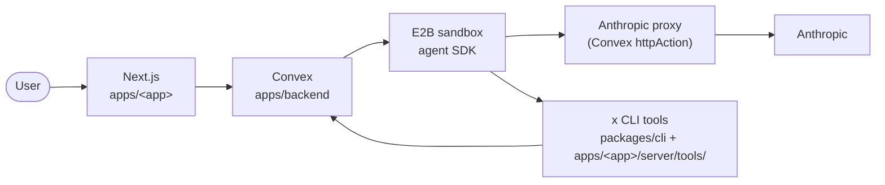

# byerag

Multi-app platform: one Convex backend + E2B sandboxes + Claude Agent SDK serving N independent web apps. Each app brings its own tool registry, system prompt, and branding; they share auth, chat, sandbox lifecycle, and the Anthropic proxy.

## What problem this solves

Building a chatbot product anyone can use — powered by the most trusted coding agent — normally means stitching together a sandbox runtime, a queue, a websocket layer, an auth boundary, a streaming UI, and spend controls. Most teams build that once per product and never reuse it.

This repo is the substrate so you don’t. One backend hosts N chatbot apps. Each app declares its tools, prompt, and UI; the platform handles every shared concern: per-user persistent VMs, streaming, retries, spend caps, auth, multi-app routing.

## Motivation

90% of the code in any chatbot product is not product-specific — it’s chat plumbing, sandbox lifecycle, key-swapping proxy, stream protocol, auth, spend caps. Splitting platform from app removes that tax: a new app is `apps/<name>/` plus a config object, ~50 LOC total. See [ARCHITECTURE.md § Why this stack](ARCHITECTURE.md#why-this-stack) for the rationale behind each piece.

## System at a glance

Full architecture: [PLAN.md](PLAN.md).

## Apps

Apps live under `apps/<name>/` — each is a Next.js web + a server config that registers the app in the manifest. See `apps/<name>/README.md` for app-specific details.

Adding a new app: drop a folder under `apps/<name>/` exporting an `AppConfig` from `<name>/server/index.ts`, register in the manifest.

## I want to…

| Task                                         | Where to go                                                                 |
| -------------------------------------------- | --------------------------------------------------------------------------- |
| Understand the overall architecture          | [PLAN.md](PLAN.md) — system diagram, 3-tier CLI, sandbox lifecycle          |
| Know the hard rules before touching anything | [RULES.md](RULES.md) — Rule / Why / Enforced-by tables                      |
| Avoid known footguns                         | [LEARNING.md](LEARNING.md) — Runtime / Framework / Ops / SDK notes          |
| Reason about threats & mitigations           | [SECURITY.md](SECURITY.md) — accepted-risk summary + discussion             |
| Run `sync` (credential loop)                 | [SYNC.md](SYNC.md) — scripts, foreground philosophy, troubleshooting        |
| Add a new tool                               | `apps/backend/convex/tools/README.md` (framework) + per-app `server/tools/` |
| Understand the CLI framework / fork it       | `apps/backend/convex/tools/README.md`                                       |
| Look up a command                            | `bun run` (root scripts) · `bun sync --help` (credential ops)               |
| Ecosystem + lintmax conventions (skim first) | [CLAUDE.md](CLAUDE.md) — pm4ai-managed, do not edit                         |

## Setup

External accounts needed: Convex self-hosted, E2B, Anthropic Console (paid API key), Google (OAuth client for user sign-in only).

`apps/backend/.env.example` lists every var with source. Fill it → `bun sync`. Fails fast naming anything missing.

Daily: `bun dev`. Run `bun sync` once whenever `.env` changes. Help: `bun sync --help`.

## Non-negotiables

- No AI attribution in commits. Never `Co-Authored-By: Claude`, never `--no-verify` (without explicit ask).
- No business tokens in root docs — enforced by `packages/cli/src/docs-boundary.test.ts`.
- `bun sync` is one-shot: read `.env` → push to Convex → exit. No daemon, no watch.
- Publishing of workspace packages is always the user’s call. Never auto-publish, never suggest.

Full list: [RULES.md](RULES.md).
