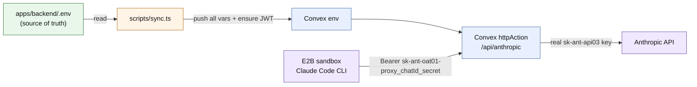

# Credential sync



`apps/backend/.env` is the single source of truth. `bun sync` reads it, pushes every required var to Convex env, ensures JWT keys exist, exits. Idempotent — safe to re-run anytime.

## Run

```
bun sync
```

One-shot. Run whenever `.env` changes (key rotation, new var, etc). No daemon, no watch loop, no launchd.

`bun sync --help` for usage.

## Source of truth

`apps/backend/.env` — only file. Web reads via `bun --env-file=../backend/.env next ...` in `apps/web/package.json` scripts. Convex CLI auto-reads. CLI binary walks up to find it.

## ANTHROPIC_API_KEY

Paid Anthropic Console API key (`sk-ant-api03-...`). Static — never expires. `sync.ts` rejects anything that doesn’t start with `sk-ant-api`.

To rotate: edit `.env`, run `bun sync`.

## Troubleshooting

| Symptom                         | Fix                                                 |
| ------------------------------- | --------------------------------------------------- |
| `Not logged in · /login` (401)  | `bun sync` (key changed in `.env`?)                 |
| Rate-limited / 429              | Anthropic returns `retry-after` header inline; wait |
| `.env missing: ...`             | Add listed keys to `.env`                           |
| `ANTHROPIC_API_KEY must be ...` | Use `sk-ant-api03-*` from console.anthropic.com     |
