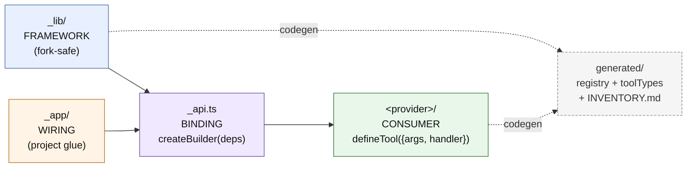

# CLI tool system — framework boundary

This directory ships a **reusable CLI tool framework**. Three-tier separation, enforced by folder + import direction.

**See also**: [PLAN.md “CLI Tool System”](../../../../PLAN.md#cli-tool-system) (flowchart) · [RULES.md “Boundaries”](../../../../RULES.md#boundaries) · [INVENTORY.md](INVENTORY.md) (generated tool catalog).

## At a glance



```
convex/tools/
├── _lib/         FRAMEWORK   (zero project refs — fork-safe)
├── _app/         WIRING      (this project's auth/cache/dispatch)
├── _api.ts      BINDING     (calls createBuilder(deps) once, re-exports)
└── <provider>/   CONSUMER    (business tools authored by end-users)
```

## `_lib/` — framework (fork-safe, zero project refs)

Generic primitives. A different project can swap `_app/` + `<provider>/` and keep `_lib/` unchanged.

| file                | purpose                                                                                 |
| ------------------- | --------------------------------------------------------------------------------------- |
| `builder.ts`        | `createBuilder<TAuth, TCtx, ...>(deps)` → `{ defineTool, defineQuery, defineMutation }` |
| `types.ts`          | `ArgSpec`, `ToolMeta`, `RegistryEntry`, `ManifestNode`, `DispatchError`                 |
| `error.ts`          | `ToolError`, `makeError`, `toDispatchError`, error→category map                         |
| `http.ts`           | `jsonRes`, `errorRes`, `parsePath`, `snakeArgs`, `newTraceId`                           |
| `manifest.ts`       | `buildTree` — registry → manifest tree for `/api/cli/manifest`                          |
| `validate.ts`       | `validateArgs` — arg coercion + constraints (pattern/min/max/integer)                   |
| `defineProvider.ts` | provider metadata validator                                                             |
| `html.ts`           | `htmlToText` — cheerio-backed readable text extraction                                  |
| `hermetic.ts`       | `setHermeticAdapter` / `hermeticTry` — generic op interception for tests                |
| `promptBlocks.ts`   | `toolListBlock(registry, opts)` — generic registry → markdown formatter                 |

**Invariant:** `_lib/` imports nothing from `_app/` or `<provider>/`. Verified by `_lib/security.test.ts` (framework-boundary guard).

## `_app/` — project wiring

Glue between `_lib/` framework and this project’s Convex app. **Replace these files to re-target the framework to a different project.**

| file                       | purpose                                                                                 |
| -------------------------- | --------------------------------------------------------------------------------------- |
| `auth.ts`                  | `AUTH_VALIDATOR` + `ResolvedAuth` — this project’s auth shape                           |
| `cache.ts`                 | `xToolCache` Convex-backed cache (24h TTL, SHA-256 key, version-isolated)               |
| `dispatch.ts`              | HTTP endpoints `/api/cli/{manifest,exec}` — auth, rate limit, validate, dispatch, trace |
| `registry.ts`              | _(generated)_ `REGISTRY` + `PROVIDERS` literal                                          |
| `toolTypes.generated.ts`   | _(generated)_ per-tool `<Name>Args` + `<Name>Result` interfaces                         |
| `toolCallers.generated.ts` | _(generated)_ typed `callers.x.y(ctx, args)` tree + `fnByPath` + `ToolTable`            |
| `schemaHashes.json`        | _(generated)_ per-tool schema fingerprint for drift detection                           |
| `hermeticOps.ts`           | project’s concrete `HermeticOps` — op types for external services this project calls    |

## `_api.ts` — thin binding

```ts
const builder = createBuilder({
  authValidator: AUTH_VALIDATOR, // from _app/auth
  cached: projectCached, // from _app/cache
  internalAction,
  internalQuery,
  internalMutation // Convex SDK
})
export const { defineTool, defineQuery, defineMutation } = builder
```

One file, one call. Tools import from here. **Never import `_lib/builder` directly from consumer code.**

## `<provider>/` — consumer tools

Business tools. Each provider is a folder with a `_provider.ts` and `.ts` tool files.

- Providers become CLI binaries (`<provider> <tool>`) via symlink.
- Tools are authored against `_api.ts` primitives; zero knowledge of `_lib/` internals.
- Providers prefixed `_` are admin-tier (e.g. `_admin/`) — stripped to `admin` on the CLI, filtered from user manifests.

## Authoring workflow

```bash
bun run new-tool <provider>/<path>/<name> [--kind=action|query|mutation]
# edit handler
bun run verify                 # fix + typecheck + test
```

Scaffold writes a tool file + integration test + regens codegen. Zero framework internals exposed.

## Extending the framework

**Fork a new project:**

1. Copy `_lib/` as-is.
2. Rewrite `_app/{auth,cache,dispatch,hermeticOps}.ts` for your stack.
3. Rewrite `_api.ts` to wire your project’s deps to `createBuilder`.
4. Author tools under your `<provider>/` folders.

No `_lib/` changes needed.

**Add a new dispatch concern (e.g. billing, feature flags):**

- If it’s generic (applies to any consumer): add to `_lib/dispatch.ts` _(does not exist — dispatch is project-wiring today)_. Actually, it goes in `_app/dispatch.ts`.
- If it’s this project’s: add to `_app/dispatch.ts`.

**Add a new arg kind (e.g. `arg.date`):**

- In `_lib/builder.ts` next to `arg.string`/`arg.number`. Generic, not project-specific.

## Discipline

- Never `import` from `_app/` or `<provider>/` inside `_lib/` — the test enforces it.
- Never author tools in `_app/` — that’s reserved for framework wiring.
- Never surface SDK-specific types in `_lib/` — wrap behind the `BuilderDeps` interface.
